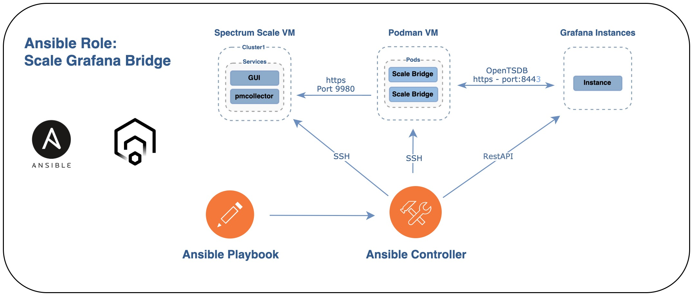

Ansible role - Spectrum Scale Bridge for grafana
=========
**First release!**


Ansible role to help with installation and configuring up Spectrum Scale for Bridge for Grafana as a container, and creates the datasource and import dashboards to Grafana.

So what is the Scale Bridge, as mention on the Github page: [github.com/IBM/ibm-spectrum-scale-bridge-for-grafana](https://github.com/IBM/ibm-spectrum-scale-bridge-for-grafana)
* The IBM Spectrum Scale bridge for Grafana could be used for exploring IBM Spectrum Scale performance data on Grafana dashboards.
Grafana Bridge is a standalone Python application. It translates the IBM Spectrum Scale metadata and performance data collected by the IBM Spectrum Scale performance monitoring tool (ZiMon) to the query requests acceptable by the Grafana integrated openTSDB plugin._


Following feature
----------------

- Downloads/GitClone the [ibm-spectrum-scale-bridge-for-grafana](https://github.com/IBM/ibm-spectrum-scale-bridge-for-grafana) to build the Container image
- Fetches the grafana gpfsconfig (/var/mmfs/gen/mmsdrfs) to be imported into the container. 
- Build Spectrum Scale grafana bridge container from source (github)
- Creates the APIKey from Spectrum Scale Cluster that is used to collect data `mmperfmon config add --apikey`
- Generate a self-signed SSL certificate, so that communication between the bridge and the Grafana instance is encrypted.  
- Starts and create a Systemd Service for the Scale Grafana bridge container. 
- Creates a Grafana RestAPI key (short lived) if it's not provided. 
- Creates the (OpenTSDB) Datasource on Grafana Instance with RestAPI calls
- Downloads a list of Spectrum Scale Grafana Dashboards from GitHub and changes the DataSource name to match. 
- Imports the same list of Spectrum Scale Grafana Dashboards to Grafana Instance. 
- The ability to Cleanup the environments





**Future plans:**
* Rootless container and systemd. run with user 
* Classic/non container version of Bridge, [Bridge-for-classic-IBM-Spectrum-Scale-devices](https://github.com/IBM/ibm-spectrum-scale-bridge-for-grafana/wiki/Setup-the-IBM-Spectrum-Scale-Performance-Monitoring-Bridge-for-classic-IBM-Spectrum-Scale-devices)
* CPU and Memory restriction on container?
* Add more example of Dashboards.
* Add more checks, check versions like Scale, OS, Grafana 
* Firewall Config.
* Run container from prebuilt image, and map the gpfsconfig into the container. need some autobuild.
* Ability to specify network interface on Container.


Tested Versions
-----------------------
* IBM Spectrum Scale  5.1.2.1 
  * Minimum level of IBM Spectrum Scale is version 5.1.1, because of the apikey
* Ansible 2.9.25
* PODMAN 3.3.1
* Redhat 8.*
* Grafana 8.3.4 and 7.5.9 

Requirements
------------

**FYI** - The Spectrum scale node can also host the PODMAN container.

**PODMAN VM**   
- GitClone
- Podman

**Network access between components, see drawing.** 
* Podman need access on port 9980 to Scale GUI/Collector node. (Default port)
* Grafana Instance need also access to Scale Grafana Bridge Container on Port 8443, (Port can be changed, if example running multiple ports.) 

**Spectrum Scale Node**
- Minimum level of IBM Spectrum Scale is version 5.1.1, because of the apikey


**Internet access**
* The role need to have internet access to gitclone the ibm-spectrum-scale-bridge-for-grafana.

**User access**
Have only tested this with root access, looking into running as user. 


Role Variables
--------------
[Variables for Roles](variables.md)

Dependencies
------------
There is requirement file in the role, so it should download the required ansoble role/collection dependencies, if it complains download them manually. 
```yaml
collections:
- name: containers.podman
- name: community.grafana
```

Example Playbook
----------------

Example playbook are place into the example folders:

Including an example of how to use your role (for instance, with variables passed in as parameters) is always nice for users too:
```yaml
---
- hosts: [scale_grafana]
  roles:
    - olemyk.ansible-spectrum-scale-bridge-for-grafana
  vars:
    scale_grafana_bridge_scale_cluster_name: "scale-test-os"  # Name of the cluster, is used to add content to seperate configur
    scale_grafana_bridge_scale_node_name: "scale-test-os-1"  #IP or hostname to the Spectrum Scale GUI/PMCollector node.
    scale_grafana_bridge_hostname: "https://10.33.3.105" #IP or hostname to where we should point the Grafana datasource to
    scale_grafana_bridge_port: 8446 # Port that will be used between Bridge and DataSource in Grafana instance, (and container network startup)
    # scale_grafana_bridge_build_image_tag: 7.0.4     # If you want to set a tag
    scale_grafana_bridge_grafana_url: "http://10.33.3.105:3000"   # Point this to your grafana instance. (Dashboard)
    # If the grafana User and Password is set, it will connect up and create a short lived apikey for import. name scale-apikey
    scale_grafana_bridge_grafana_user: admin
    scale_grafana_bridge_grafana_password: "jkn-cwu6umt@MPZ2fkd"
    # Create a API key manually in the grafana instance/server.
    # scale_grafana_bridge_grafana_api_key: 'eyJrIjoiSmd0SFFkZ1Q1TFFuZjRYVDlBcGlPcnZr' # If this is set then it will not use the grafana user.
    scale_grafana_bridge_cleanup: false
```


###Host file
* Create the hostfile, with
  * `scale_grafana_bridge_scale_host=true` = This the Spectrum Scale host with GUI/PMCollector, host that we want to point the scale-grafana-bridge against. 
  * `scale_grafana_bridge_container_host=true` = This the host that you want to run the grafana bridge container. 
```
[scale_grafana]
scale-test-os-1 ansible_host=10.33.3.107 scale_grafana_bridge_scale_host=true
podman          ansible_host=10.33.3.105 scale_grafana_bridge_container_host=true
```

Reporting Issues and Feedback
--------------------------------

Please use the issue tracker to ask questions, report bugs and request features.

License
-------

Apache License 2.0

Author Information
------------------

Ole Kristian Myklebust, 2022
